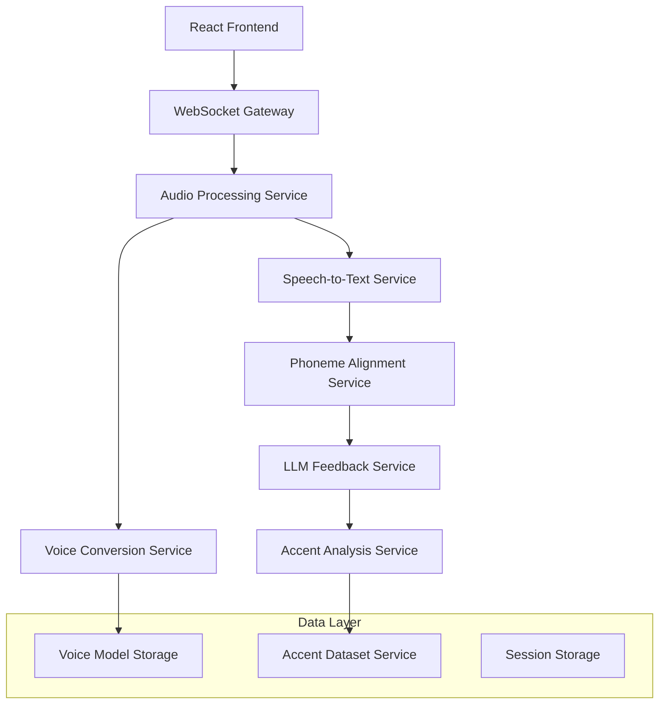

# Design Document

## Overview

Parrot is an accent learning platform that combines multiple AI technologies to provide personalized pronunciation training. The system integrates voice cloning, speech-to-text, phoneme analysis, and LLM-powered feedback to create an interactive learning experience. The architecture follows a microservices approach with real-time audio processing capabilities.

## Architecture

### High-Level Architecture



### System Components

1. **Frontend Layer**: React SPA with WebRTC integration
2. **Gateway Layer**: WebSocket gateway for real-time communication
3. **Processing Layer**: Microservices for audio processing, STT, voice conversion
4. **Analysis Layer**: Phoneme alignment and accent analysis services
5. **Intelligence Layer**: LLM service for feedback generation
6. **Data Layer**: Storage for voice models, datasets, and session data

## Components and Interfaces

### Frontend Components

#### Audio Capture Component
- **Purpose**: Capture user audio via WebRTC
- **Interface**: 
  ```typescript
  interface AudioCapture {
    startRecording(): Promise<void>
    stopRecording(): Promise<AudioBlob>
    getAudioStream(): MediaStream
    setQuality(sampleRate: number): void
  }
  ```
- **Implementation**: Uses WebRTC getUserMedia API at 16kHz sampling rate

#### Feedback Visualization Component
- **Purpose**: Display phoneme-level feedback as heatmap
- **Interface**:
  ```typescript
  interface FeedbackVisualization {
    displayHeatmap(phonemeScores: PhonemeScore[]): void
    showAmplitudeVisualization(audioData: Float32Array): void
    togglePanicMode(enabled: boolean): void
  }
  ```

#### Scenario Interface Component
- **Purpose**: Present interactive training scenarios
- **Interface**:
  ```typescript
  interface ScenarioInterface {
    loadScenario(scenarioId: string): Promise<Scenario>
    displayPrompt(prompt: string): void
    handleUserResponse(audio: AudioBlob): Promise<void>
  }
  ```

### Backend Services

#### Audio Processing Service
- **Purpose**: Central hub for audio processing pipeline
- **Interface**:
  ```typescript
  interface AudioProcessingService {
    processAudio(audioBlob: AudioBlob): Promise<ProcessingResult>
    validateAudioQuality(audio: AudioBlob): boolean
    convertAudioFormat(audio: AudioBlob, targetFormat: string): AudioBlob
  }
  ```
- **Implementation**: Coordinates between STT, voice conversion, and analysis services

#### Speech-to-Text Service
- **Purpose**: Convert audio to text using Whisper-tiny
- **Interface**:
  ```typescript
  interface STTService {
    transcribe(audio: AudioBlob): Promise<TranscriptionResult>
    getConfidenceScore(transcription: TranscriptionResult): number
  }
  ```
- **Implementation**: Uses Whisper-tiny model for fast, accurate transcription

#### Voice Conversion Service
- **Purpose**: Handle voice cloning and conversion using E2E models
- **Interface**:
  ```typescript
  interface VoiceConversionService {
    createVoiceModel(voiceSample: AudioBlob): Promise<VoiceModel>
    convertVoice(audio: AudioBlob, targetVoice: VoiceModel): Promise<AudioBlob>
    validateVoiceSample(audio: AudioBlob): ValidationResult
  }
  ```
- **Implementation**: Uses VITS-based or S-VC models for voice conversion

#### Phoneme Alignment Service
- **Purpose**: Align phonemes using Montreal Forced Aligner
- **Interface**:
  ```typescript
  interface PhonemeAlignmentService {
    alignPhonemes(audio: AudioBlob, transcript: string): Promise<PhonemeAlignment>
    analyzePhonemeAccuracy(alignment: PhonemeAlignment, targetAccent: string): PhonemeScore[]
  }
  ```

#### LLM Feedback Service
- **Purpose**: Generate natural language feedback and scenarios
- **Interface**:
  ```typescript
  interface LLMFeedbackService {
    generateFeedback(phonemeScores: PhonemeScore[]): Promise<string>
    createScenario(userPreferences: UserPreferences): Promise<Scenario>
    analyzeErrors(phonemeErrors: PhonemeError[]): Promise<string>
  }
  ```

#### Accent Analysis Service
- **Purpose**: Analyze and blend accents using dataset gradients
- **Interface**:
  ```typescript
  interface AccentAnalysisService {
    analyzeAccent(audio: AudioBlob): Promise<AccentProfile>
    blendAccents(sourceAccent: string, targetAccent: string, ratio: number): AccentModel
    getAccentSimilarity(audio1: AudioBlob, audio2: AudioBlob): Promise<number>
  }
  ```

## Data Models

### Core Data Types

```typescript
// Audio and Processing Types
interface AudioBlob {
  data: ArrayBuffer
  sampleRate: number
  duration: number
  format: string
}

interface TranscriptionResult {
  text: string
  confidence: number
  timestamps: TimeStamp[]
}

interface PhonemeAlignment {
  phonemes: Phoneme[]
  timestamps: TimeStamp[]
  confidence: number
}

interface Phoneme {
  symbol: string
  startTime: number
  endTime: number
  accuracy: number
}

interface PhonemeScore {
  phoneme: string
  accuracy: number
  feedback: string
  position: number
}

// Voice and Accent Models
interface VoiceModel {
  id: string
  embeddings: Float32Array
  metadata: VoiceMetadata
  createdAt: Date
}

interface AccentProfile {
  accentId: string
  characteristics: AccentCharacteristic[]
  similarity: number
}

interface AccentCharacteristic {
  phoneme: string
  feature: string
  value: number
}

// Training and Scenarios
interface Scenario {
  id: string
  title: string
  description: string
  prompts: ScenarioPrompt[]
  difficulty: number
}

interface ScenarioPrompt {
  text: string
  expectedResponse: string
  context: string
}

// User and Session Data
interface UserSession {
  sessionId: string
  voiceModel?: VoiceModel
  targetAccent: string
  currentScenario?: Scenario
  progress: SessionProgress
}

interface SessionProgress {
  completedPrompts: number
  averageAccuracy: number
  improvementAreas: string[]
}
```

### Data Flow Models

```typescript
interface ProcessingPipeline {
  input: AudioBlob
  transcription: TranscriptionResult
  phonemeAlignment: PhonemeAlignment
  phonemeScores: PhonemeScore[]
  feedback: string
  output: FeedbackResult
}

interface FeedbackResult {
  overallScore: number
  phonemeScores: PhonemeScore[]
  naturalLanguageFeedback: string
  recommendations: string[]
  heatmapData: HeatmapPoint[]
}
```

## Error Handling

### Error Categories

1. **Audio Processing Errors**
   - Invalid audio format
   - Poor audio quality
   - Processing timeout
   - Model inference failures

2. **Service Communication Errors**
   - WebSocket connection failures
   - Service unavailability
   - Request timeout
   - Data corruption

3. **User Experience Errors**
   - Microphone access denied
   - Browser compatibility issues
   - Network connectivity problems

### Error Handling Strategy

```typescript
interface ErrorHandler {
  handleAudioError(error: AudioError): ErrorResponse
  handleServiceError(error: ServiceError): ErrorResponse
  handleNetworkError(error: NetworkError): ErrorResponse
}

interface ErrorResponse {
  userMessage: string
  retryable: boolean
  fallbackAction?: string
  technicalDetails?: string
}
```

### Graceful Degradation

- **Offline Mode**: Cache voice models locally for basic functionality
- **Reduced Quality**: Fall back to lower quality processing if resources are limited
- **Alternative Feedback**: Provide text-based feedback if audio processing fails
- **Panic Mode**: Instant mute functionality to reduce user anxiety

## Testing Strategy

### Unit Testing

1. **Component Testing**
   - Audio capture functionality
   - Feedback visualization accuracy
   - Data model validation
   - Service interface contracts

2. **Service Testing**
   - STT accuracy with various accents
   - Voice conversion quality
   - Phoneme alignment precision
   - LLM feedback relevance

### Integration Testing

1. **Pipeline Testing**
   - End-to-end audio processing flow
   - Real-time communication between services
   - Data consistency across services
   - Error propagation and handling

2. **Performance Testing**
   - Audio processing latency (target: <2 seconds)
   - WebSocket connection stability
   - Memory usage during voice model creation
   - Concurrent user handling

### User Acceptance Testing

1. **Accent Training Effectiveness**
   - Phoneme accuracy improvement over time
   - User satisfaction with feedback quality
   - Scenario engagement and completion rates

2. **Usability Testing**
   - Audio capture ease of use
   - Feedback comprehension
   - Interface responsiveness
   - Error recovery experience

### Test Data and Scenarios

1. **Audio Test Cases**
   - Various accent samples from VCTK dataset
   - Different audio qualities and formats
   - Edge cases (very quiet, very loud, background noise)

2. **Scenario Test Cases**
   - Common conversational scenarios (café, interview, casual)
   - Different difficulty levels
   - Various target accents (American, British, Australian)

### Automated Testing Pipeline

```typescript
interface TestPipeline {
  runUnitTests(): Promise<TestResult[]>
  runIntegrationTests(): Promise<TestResult[]>
  runPerformanceTests(): Promise<PerformanceMetrics>
  validateAudioProcessing(testCases: AudioTestCase[]): Promise<ValidationResult>
}
```

### Quality Metrics

- **Accuracy Metrics**: Phoneme detection accuracy, accent similarity scores
- **Performance Metrics**: Processing latency, memory usage, throughput
- **User Experience Metrics**: Task completion rate, error recovery success
- **System Metrics**: Service availability, response times, error rates